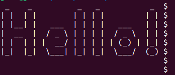
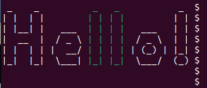
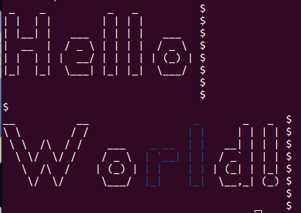

# ASCII-Art-Color

This is a program written in Go which consists in receiving a string as an argument and displaying the output in a graphic representation using ASCII using various font colors.

## Features

 - Accepts input strings through the terminal and displays the input string in an ASCII format.

 - Capable of changing the color of output to be displayed on the terminal based on the specified color.

## Getting Started

Go programming language must be installed on the user's local environment in order to run the program. Download and install Go using the link below:

https://go.dev/doc/install

## Installation

1. 
Clone the repository to your local environment
```
$ git clone https://github.com/johneliud/ASCII-Art-Color
```

2. 
Navigate to the projects path on your local environment
```
$ cd ASCII-Art-Color
```

## Usage

The program can be run in various ways as illustrated below:

```
$ go run . <input-string>
```

or

```
go run . --color=<color> <input-string>
```

or

```
go run . --color=<color> <substring> <input-string>
```

**NOTE:**

The program currently supports a limited number of colors listed below:

```
red
green
blue
orange
yellow
black
white
pink
teal
purple
brown
beige
indigo
violet
maroon
cream
```
Any other specification by the user will result in an error message informing them the color is not supported. Consider using the RGB() format when specifying colors.

## Examples

Below are examples of commands to run the program with the expected output.

1. Run program to display "Hello"
```
 $ go run . "Hello" | cat -e
```

Output




2. Run program to display "Hello" with an orange font color
```
 $ go run . --color="orange" "Hello" | cat -E
```

Output


3. Run program to display "Hello" with a green font color of the "l" substring present in the string using RGB() format
```
 $ go run . --color="RGB(0, 255, 0)" "l" "Hello" | cat -E
```

Output




4. Run program to display "Hello World" with a blue font color of the "rl" substring present in the string using RGB() format. The '\n\n' command displays the string on two newlines.
```
 $ go run . --color="RGB(0, 0, 255)" "rl" "Hello\n\nWorld!" | cat -E
```

Output



## Contact

Feel free reaching out to me through the email address johneliud4@gmail.com
